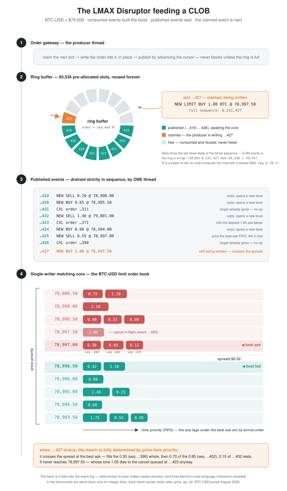

# One Order Book, Four Languages, and the Tail That Lied

*What building the same matching engine in Java, Rust, Go, and C++ — then tuning it, pinning it, and moving it to Linux — taught me about where latency actually comes from.*

> "The first principle is that you must not fool yourself — and you are the easiest person to fool."
> — Richard Feynman

---

I've spent a good part of my career around trading systems, where one debate has run for as long as I can remember: which language do you build the hot path in? Everyone has a position. Almost nobody has measurements where *everything else is held equal* — same algorithm, same workload, same architecture, same machine — so the argument never resolves.

So I held everything else equal.

I built the same limit-order-book matching engine four times on the LMAX architecture — the single-writer pattern LMAX Exchange made famous fifteen years ago: all business state owned by one thread, fed events through a lock-free ring buffer, no locks anywhere near the matching logic. Java got the original [`com.lmax.disruptor`](https://github.com/LMAX-Exchange/disruptor). Rust got the [`disruptor` crate](https://crates.io/crates/disruptor). Go and C++ got hand-rolled SPSC rings, because neither has a canonical Disruptor library and the pattern is about forty lines.

The part I'm most pleased with is not the benchmark — it's the *proof of fairness*. All four implementations consume a bit-identical operation stream from the same splitmix64 generator (55% passive limit orders, 30% aggressive, 15% cancels, a random-walking mid), and every run prints a deterministic checksum of the final book. All four languages produce the same checksum, every run. That's only possible because the LMAX architecture makes the engine deterministic by design — and it means every number below describes *identical work*. (The full spec and reference vectors are published in the repo as a conformance suite — if you build a fifth implementation and match the checksums, your engine is behaviorally identical to all four.)

## Round 1: each runtime pays somewhere different

On my M1 Max, with a paced producer and coordinated-omission-safe timestamps, the medians were the first surprise: **essentially identical**. Java, Rust, Go, C++ — all process an order through the ring and the book in a few hundred nanoseconds at p50.[^1] The architecture sets the median. The language debate, at the median, is about nothing.

The tail is where the runtimes show their character (µs, ranges across runs):

| percentile | Java | Rust | Go | C++ |
|---|---:|---:|---:|---:|
| p99.9 | 1,674 – 8,208 | 37 – 3,070 | **29 – 48** | 24 – 56 |
| p99.99 | 4,018 – 13,509 | 2,204 – 8,294 | **79 – 179** | 1,752 – 1,907 |

Three findings I didn't fully expect:

**Java's tail is GC-bound and perfectly reproducible.** Milliseconds at p99.9, every run, tracking the collection counters one-for-one. Not bad luck — a tax schedule.

**Go was the shock.** The tightest, most reproducible tail of all four — including the two languages with no garbage collector. Go's collector is designed for exactly this: concurrent marking, sub-millisecond stop-the-world phases (1.2ms *total* across 13 cycles, versus Java's 41–48ms across 9). It runs constantly and barely shows at p99.99. The price appears elsewhere — lowest throughput of the four. **GC design matters more than GC presence.**

**Idiomatic C++ lost to Java on throughput.** Read that again; I had to. `std::map` allocates a node per price level, `std::deque` a chunk per block — 5.5 million inline mallocs over a 10M-op run — and malloc is *slower per object* than the JVM's bump-pointer allocation. Java allocates faster and pays later, as GC, in the tail; C++ pays retail, inline, on every node.

That left a loose end. Rust and C++ — the no-GC languages — still showed millisecond spikes at p99.99. I wrote "OS scheduler jitter" in my notes, which sounded right: no collector, unpinned threads, a desktop machine. Blame the scheduler.

That diagnosis was wrong, and finding out how was the best part of the study.

## Round 2: the tail that lied

I moved the benchmark to Linux (an i9-13980HX) and added two things. First, thread pinning to dedicated P-cores — if the scheduler is the tail, pinning should kill it. Second, a *tuned* engine in each language: a dense array-backed price ladder with best-bid/ask pointers instead of an ordered tree, pooled level queues that are cleared rather than freed, and a fast pre-reserved id map (FxHash in Rust, an identity hash in C++). Near-zero allocation in steady state — or so I believed; hold that thought. Same semantics; the checksums still match, bit for bit.

If the scheduler theory was right, pinning alone should fix the idiomatic engines. Here's what actually happened (Rust, Linux, µs):

| config | p99.99 | max |
|---|---:|---:|
| idiomatic | 1,757 | 2,376 |
| idiomatic, **pinned** | 1,813 | 2,433 |
| tuned | 20.7 | 155 |
| tuned, **pinned** | **17.0** | **54.6** |

**Pinning did nothing.** The idiomatic tail didn't move. Switching to the zero-allocation engine collapsed p99.99 by nearly two orders of magnitude *without* pinning. The tail I had confidently blamed on the OS was mostly the allocator all along — malloc slow paths and page faults from constant node churn, arriving rarely enough to hide beyond p99.9, where they're easy to attribute to someone else. Pinning only started paying *after* the allocator was out of the picture, cutting the worst case from 155µs to 54.6µs. Tuning layers compose in a specific order, and the order matters.

The floor: **17µs at p99.99, 54.6µs worst case, across 1.6 million measured operations** — four orders of magnitude below where idiomatic Java started, same algorithm, same workload, verified by the same checksum.

## The optimization that wasn't

One lesson, earned honestly. The C++ tuned engine's id map first shipped with a splitmix-mixed hash — textbook practice, well-distributed, no clustering. It benchmarked **25% slower** than the idiomatic engine it was supposed to beat. The fix was to *delete the mixing*: order ids are sequential, and under an identity hash, sequential ids land in adjacent buckets — cache-resident, prefetch-friendly. The well-mixed hash scattered every lookup across a 32MB table and turned each one into a cache miss. Hash quality lost to cache locality. The story is preserved in the code as a comment, because I will be tempted again. It turned out to have a third chapter — Round 4.

## Round 3: the GC languages fight back

Fairness demanded tuned Go and Java too — same array ladder, and the id map replaced by primitive arrays (`long[] price`, `long[] qty` indexed by id: no boxing, no hashing, no allocation).

**Zero-garbage Java was the fastest configuration in the study so far.** 25–34M ops/s, trading blows with tuned Rust's 28–30M — and its latency runs report **zero GC collections**. With nothing allocated, the collector never runs, so the GC tail doesn't shrink; it *ceases to exist* (p99.9: 921µs → 2.6µs). This is the LMAX thesis reproduced from scratch: Java was never slow — its *idioms* were. The JIT compiles allocation-free primitive-array code as well as anything. The cost is on the page: the tuned Java no longer looks like Java anyone writes by default, which is exactly what LMAX engineers have been saying for fifteen years.

Two runtime-character findings survived tuning:

**Pinning a GC'd runtime without budgeting cores for the collector is a disaster.** Restricting the Java process to the same two cores the Rust runs were pinned to — so the busy-spin threads starved the collector and the JIT — made things dramatically *worse* than no pinning at all (p99.9 blew out to 7.6ms). Go took the identical restriction gracefully; it actually improved. Affinity plans must count the runtime's helper threads, not just your own.

**Go remained the tail's honest broker.** Tuned and confined to two cores, it posted p99.9 of 3.3µs — matching Rust at that percentile — with the smallest run-to-run variance of anything measured.

## Round 4: the study fails its own test

This section exists because, while preparing this post, I finally looked at a number that had been printed in front of me the whole time.

Every run of every engine prints its heap allocation count — it's how Round 1 caught idiomatic C++'s 5.5 million mallocs. Nobody had read it for the *tuned* C++ engine, because that engine was "obviously" allocation-free. It wasn't: **1,029,698 allocations over a 2M-op run**, one per resting order, barely fewer than the idiomatic engine's 1,165,249.

The culprit is the C++ standard itself. `std::unordered_map` guarantees stable element addresses, which forces a node-based implementation: `reserve()` sizes only the bucket array, so every `emplace` still mallocs a node and every `erase` frees one. The identity-hash fix in "the optimization that wasn't" had treated the *lookup* cost and left the *allocator* on the hot path. And I had then filed tuned C++'s 90µs p99.99 under "runtime character" — the same class of mistake as "scheduler jitter," made by the same author, in the same study, one round after learning the lesson. You must not fool yourself, and you are the easiest person to fool, *serially*.

Two fixes, semantics untouched, checksums identical. The id map became what Java and Go already had: a preallocated array indexed directly by order id (`qty == 0` marks a dead slot) — no hash, no probe, no nodes. Allocations per 2M-op run: 1,029,698 → 9,895. And the hand-rolled ring gained the real Disruptor's *cached gating sequence* — the producer keeps a private lower bound of the consumer's cursor and touches the shared cache line only when the ring looks full — plus a batch-draining consumer.

Same box, same P-cores, and Rust rebuilt and re-run in the same session for a fair same-day comparison (µs):

| config | p99.9 | p99.99 | max |
|---|---:|---:|---:|
| C++ tuned, pinned (Round 2 — the map) | 2.7 | 89.9 | 203 |
| **C++ tuned, pinned (Round 4 — the array)** | **2.6–3.7** | **13.7–15.3** | **74.6–116** |
| Rust tuned, pinned (same day) | 4.9–9.7 | 38.8–42.8 | 138–158 |

**C++ went from last place to first** — and throughput tripled, from 16M to **49M ops/s**, 1.8x the same-day tuned Rust. One honest caveat cuts both ways: Rust measured 39–43µs today against 17µs on its Round 2 day (an un-isolated box's day-to-day range — same-day comparisons are the only trustworthy ones), and Rust's tuned engine still hashes and probes an FxHash map where C++ now indexes an array. The podium order is a function of who most recently earned zero allocation. That is precisely the point.

## The final ladder

At p99.99, on the same Linux box, same checksummed workload — as it stands after Round 4:

**tuned C+++pinned ~14µs → tuned Rust+pinned ~40µs (17µs on its best day) → tuned Java 63µs → tuned Go 68µs** — four runtimes still within ~5x of each other — versus a **~450x spread** across the idiomatic engines. The order has changed hands three times; the sentence for the whole study hasn't: **discipline compressed a 450x language gap into a 5x runtime-character gap.**

## What I'd tell you to take away

1. **The architecture sets your median; your allocation strategy sets your tail; the language mostly picks which of those you fight.** Rust makes zero-allocation the natural idiom. Java and Go make it a discipline you enforce against the language's grain, forever. C++ makes everything manual, including the mistakes.
2. **Measure, then re-measure your attribution.** My "scheduler jitter" explanation was plausible, confident, and wrong — and one round after learning that lesson I did it again, filing a million hidden mallocs under "C++ runtime character." The percentile where a cost appears tells you almost nothing about its cause; only an experiment that removes one suspect at a time does.
3. **GC design matters more than GC presence — and allocation strategy matters more than either.** Go's collector is invisible at these percentiles out of the box; Java's is brutal idiomatically and *gone* at zero garbage. The GC was never the enemy. The allocation was.
4. **Tuning composes in order:** allocation discipline first, placement second — and when you pin, budget cores for the runtime you brought with you.
5. **Determinism is the highest-leverage property.** The single-writer design didn't just make the engines fast — it made them *provably comparable* across four languages with one checksum, and it's the same property that gives you replay-based recovery and an audit trail in production. The speed is a side effect.
6. **"Zero-allocation" is a measured property, not a declared one.** Put an allocation counter in the harness and read it for every engine — especially the one that's obviously allocation-free. Mine printed the truth on every run for weeks while I wrote "near-zero allocation" in the docs; the standard library (`std::unordered_map` is node-based *by the standard* — `reserve()` doesn't touch it) was allocating a node per order the entire time. Believe the counter over your own comments.

All the code, the workload spec, the conformance vectors, and every number in this post: **[github.com/paul-weiss/lmax-bench](https://github.com/paul-weiss/lmax-bench)** (MIT). Run it on your own hardware — I'd genuinely like to see the tails on an EPYC or a Graviton.

[^1]: Notation, for anyone who doesn't stare at latency histograms for a living: **pN is the Nth-percentile latency** — p50 is the median, the typical operation; p99.9 is the worst operation in a thousand; p99.99 the worst in ten thousand. At millions of operations per second, a "1 in 10,000" event happens hundreds of times a second — which is why trading systems are judged by their tail, not their median.
